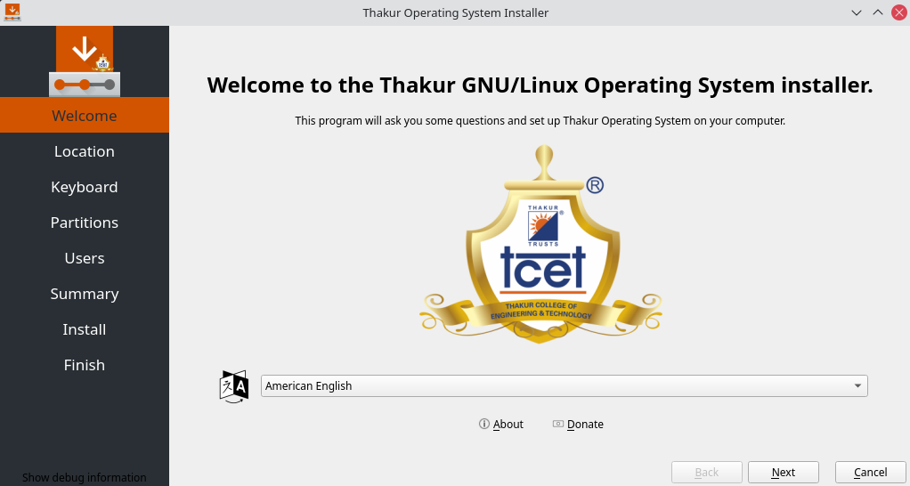

# tos-calamares
<b>Calamares Installer for Thakur OS</b> 
Calamares is a universal installer framwork for Linux distributions. This repository contains Thakur OS specific modules & configurations above the framework.
This repository contains software which is still under development. 

<h2>How to Get TOS-Calamares on your system to test it?</h2>
Clone TOS-calamares from GitHub, run CMake, and compile it:  
<code>$ git clone https://github.com/thakuros/tos-calamares.git </code> 
<code>$ mkdir tos-calamares/build</code> 
<code>$ cd tos-calamares/build</code> 
<code>$ cmake -DCMAKE_BUILD_TYPE=Debug ..</code> 
<code>$ make</code> 
 

This will give you a debug build of Calamares, with debug symbols. It can then be run straight from the build directory without installing in one of the following ways:
  
<code>$ ./calamares -d</code> 
<code>$ sudo ./calamares -d</code> 
<code>$ pkexec ./calamares -d</code> 
 

<h2>Calamares dependencies</h2>
There are applications you need to install on your development computer in order to successfully build calamares. Use your package manager to install these. On Arch, we will use pacman. Applications are listed below:
  <ul>From Arch Official Repos
  <li>Compiler with C++17 support: GCC >= 7 or Clang >= 5</li>
  <li>CMake >= 3.3</li>
  <li>Qt >= 5.9</li>
  <li>yaml-cpp >= 0.5.1</li>
  <li>Python >= 3.3 (required for some modules)</li>
  <li>Boost.Python >= 1.55.0 (required for some modules)</li>
  <li>KDE extra-cmake-modules >= 5.18 (recommended; required for some modules; required for some tests)</li>
  <li>KDE Frameworks KCoreAddons (>= 5.58 recommended)</li>
  </ul>
  We can install all of these by typing: 
  <code>sudo pacman -S gcc cmake qt yaml-cpp python boost extra-cmake-modules kcoreaddons</code> 
   
Additionally to build the software, you will need mkinit-openswap and ckbcomp packages. These are in the official <b>Thakur OS</b> repositories. If you are already running <a href="https://sourceforge.net/projects/arch-linux-gui">ALG</a> or <b>Thakur OS</b>, then you can install these dependencies with  
 <code>sudo pacman -S mkinitcpio-openswap</code> and 
 <code>sudo pacman -S ckbcomp</code> 
 
 otherwise, you need to manually install them via the AUR.
 

  
This repository is linked to the ThakurOS <a href="https://github.com/thakuros/TOS-pkgbuild/tree/master/calamares">PKGBULD</a> repository. You can visit there to build the installer tarball (in zst format), which will be on the ISO. The frontend branding modules are in the <a href="https://github.com/thakuros/TOS-calamares-config">configurations</a> repository. 

<h2>Screenshot</h2>
 

